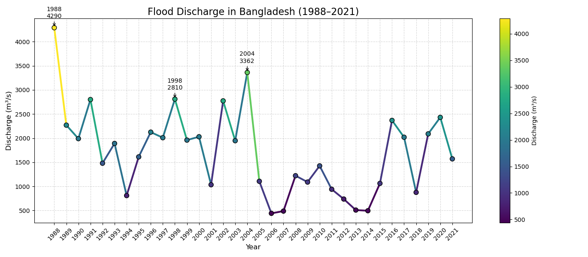
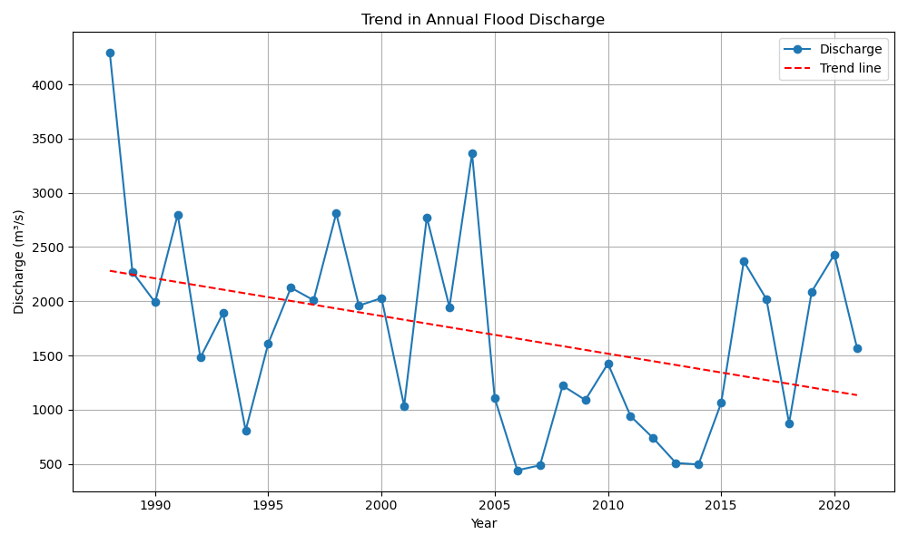
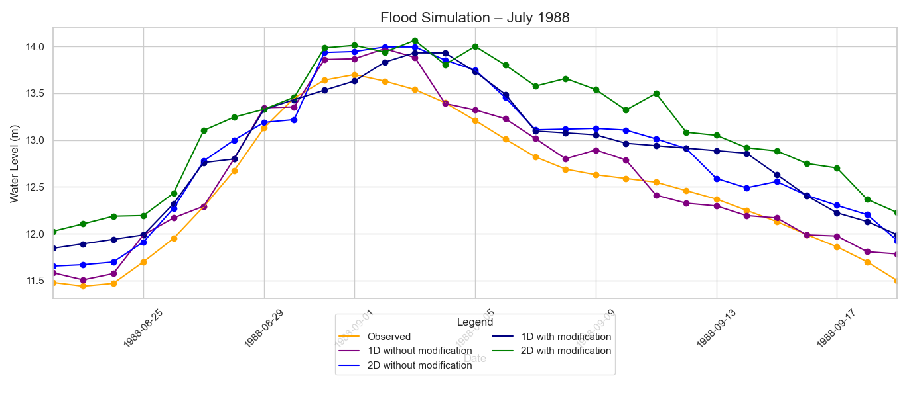
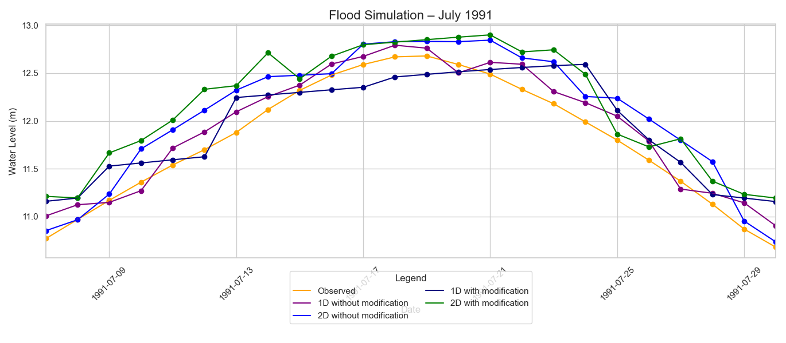
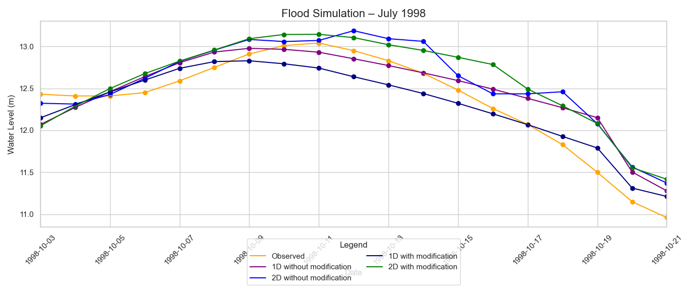
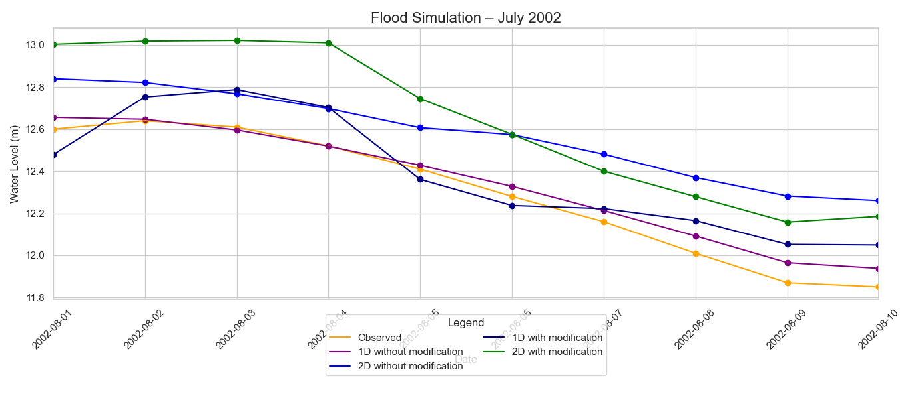
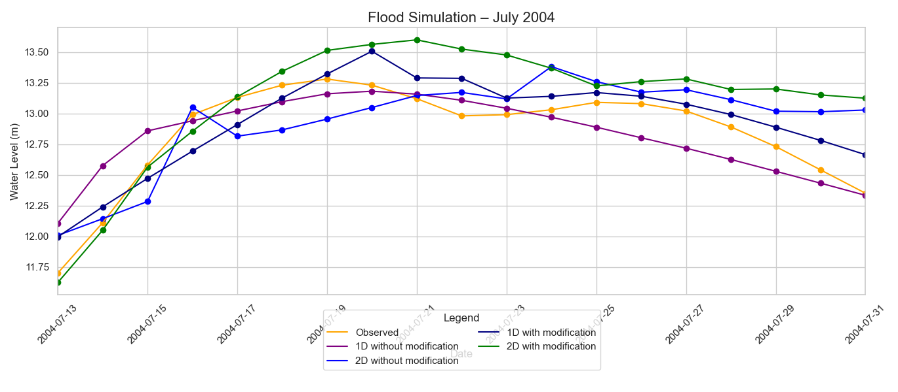
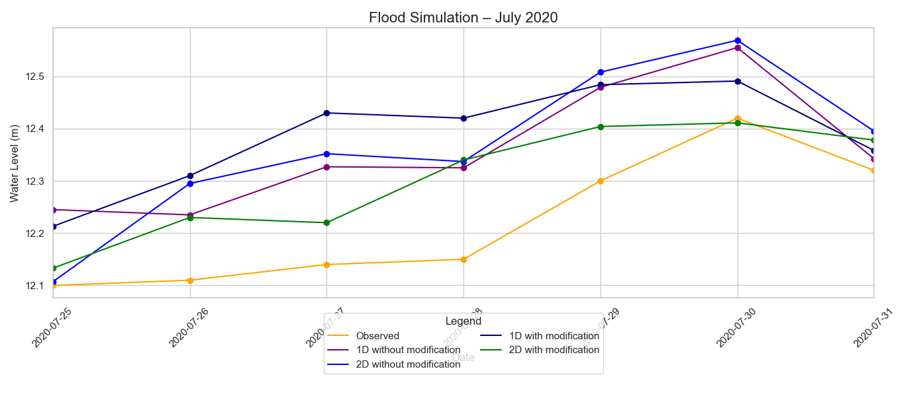

# Flood Simulation Model

### 1. Flood Intensity Index (FII)

Interactive visualization of FII values computed from peak discharge and flood duration (above 12.0m threshold) for major flood years: **1988, 1991, 1998, 2002, 2004, 2020**.

📌 _FII Formula:_  
\[
\text{FII} = \frac{\text{Peak Discharge} \times \text{Duration Above Threshold}}{100}
\]

🔗 **Code**: [`fii_plotly.py`](scripts/FII.py)


---

### 2. Annual Flood Discharge Trend (1988–2021)

Line chart showing yearly peak discharges, with extreme years highlighted for context.

🔗 **Code**: [`discharge_plot.py`](scripts/fds.py)


🔗 **Code**: [`trend_analysis.py`](scripts/trend_analysis.py)



---

### 3. Flood Simulation Time Series

Daily model outputs (columns A–E) plotted for each major flood year.

#### 📆 1988 Flood Model Simulation



#### 📆 1991 Flood Model Simulation



#### 📆 1998 Flood Model Simulation



#### 📆 2002 Flood Model Simulation



#### 📆 2004 Flood Model Simulation



#### 📆 2020 Flood Model Simulation



---

## 📌 Data Source

**Title:** Validation of 1D and 2D Model Results with the Observed Data of the Old Brahmaputra River at Mymensingh Gauge Station  
**Type:** Daily discharge data, model simulations, annual discharge records  
**Source Format:** Excel (.xlsx)

---

## ⚙️ Environment Setup

```bash
# Create conda environment
conda create -n flood_model python=3.10
conda activate flood_model

# Install required packages
pip install pandas plotly seaborn matplotlib openpyxl
```

## ✍️ Author

**Rubel Fakir**  
📍 Savar, Dhaka  
📧 rubel.mehmut@gmail.com  
🔗 [LinkedIn](https://linkedin.com/in/rubelmehmed) | [GitHub](https://github.com/rubelmehmed)

---

## 👨‍🏫 Supervisor & Co-Author

**Dr. Muhammad Rezaul Rakib**  
_Associate Professor, Dept. of Geography & Environment, Jahangirnagar University_

🎓 MSc in Flood Risk Management (University of Hull, UK — VC Scholar)  
🧠 Expert in HEC-RAS, GIS, Remote Sensing, Riverbank Erosion, Climate Risk  
🏛 Roles: BNGA Office Secretary · JUTA Executive Member · JU Senate Member

🔗 [Google Scholar](https://scholar.google.com/citations?user=tyS_C0YAAAAJ&hl=en)

## 📄 License

This project — including simulation plots, time-series visualizations, and flood model interpretations — is licensed under the [MIT License](LICENSE).  
Authored by **Rubel Fakir** and **Dr. Muhammad Rezaul Rakib**, you are free to use, adapt, and share the materials with proper credit.
